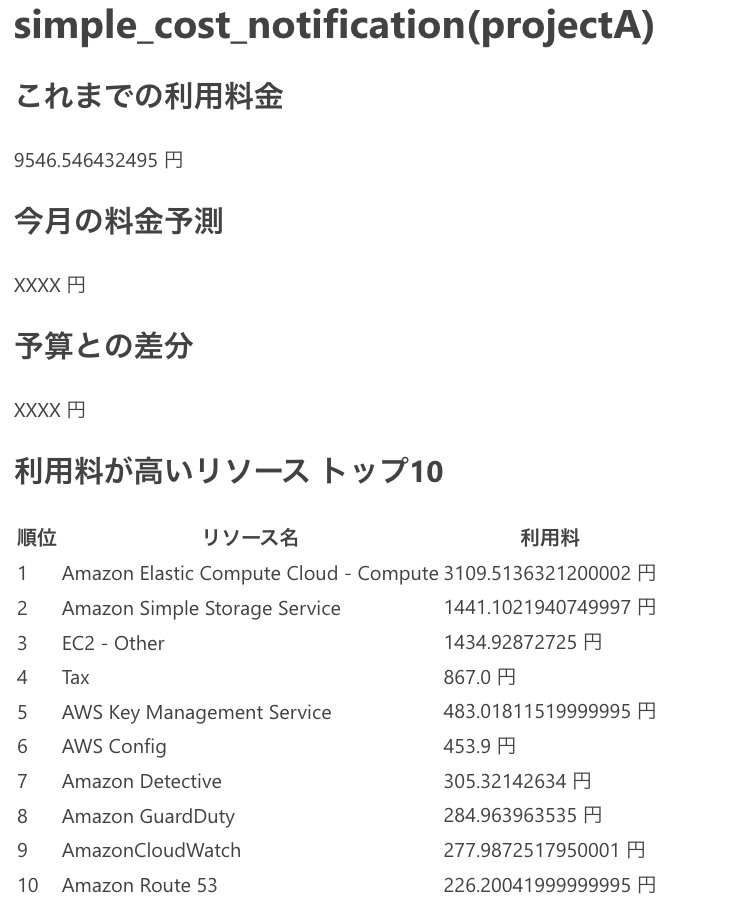

# simple_cost_notfication

## セットアップ

1. 送付先メールアドレスをSESに登録
2. Secret Parameter Storeを`/SimpleCostNotification/AZClientSecret`という名前で作成
3. `simple-cost-notification.yml`をデプロイ
4. `.env.sample`を参考に`.env`を作成
5. ssmパラメータストアに`project_data_template.json`の形式でデータを投入
   - 全てのAWSアカウントを設定する必要はない
   - 指定しなかったAWSアカウントの料金は`default_project`で指定したプロジェクトに含まれる
6. `upload_zip_code.sh`でlambda関数をデプロイ

## プログラムについて

毎日9:30ごろ料金を計算し指定したメールアドレスに対して以下のようなメールを送信する。
